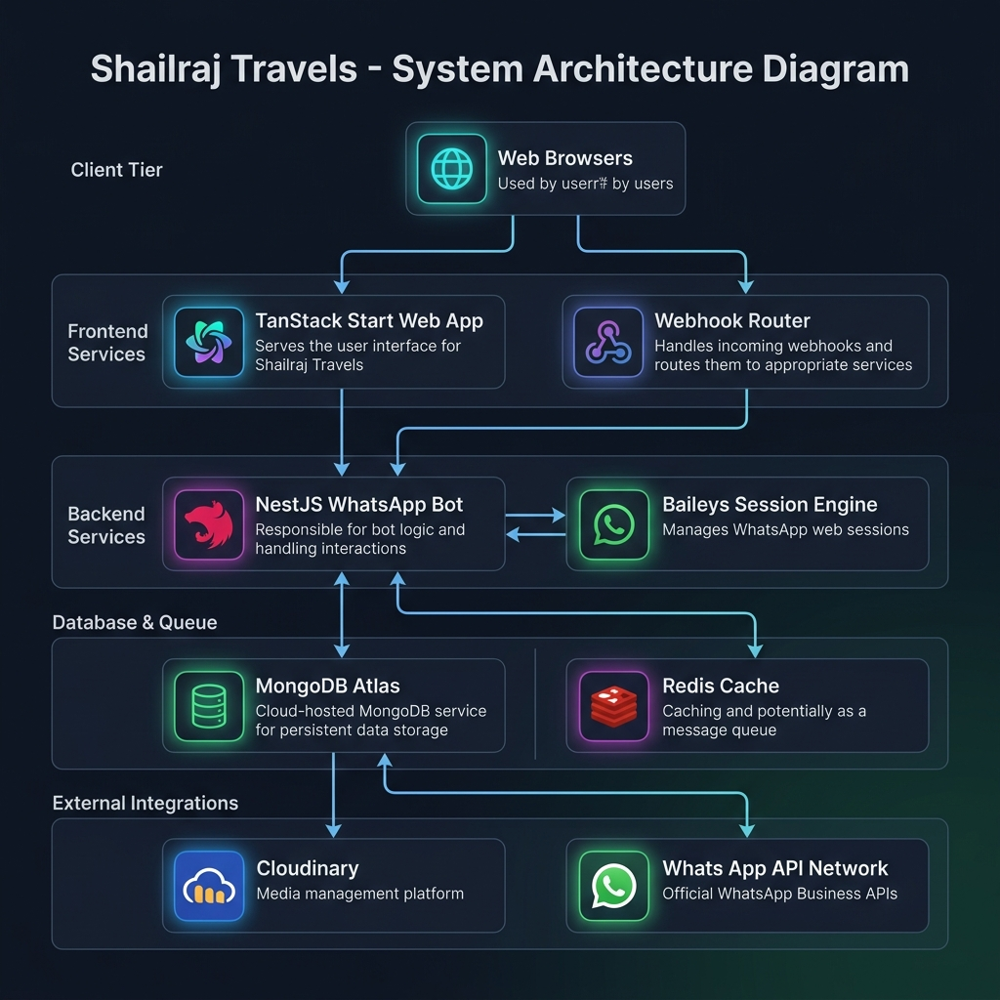
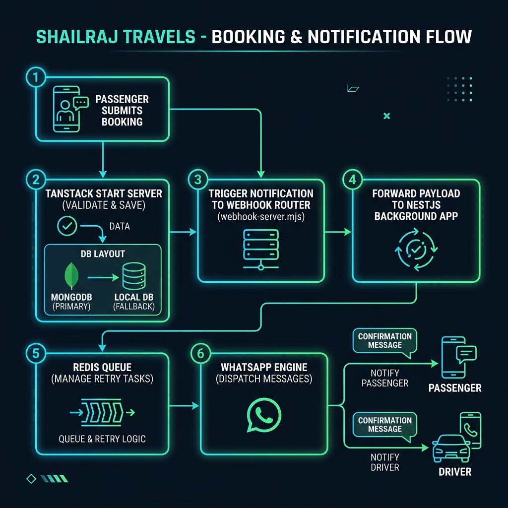
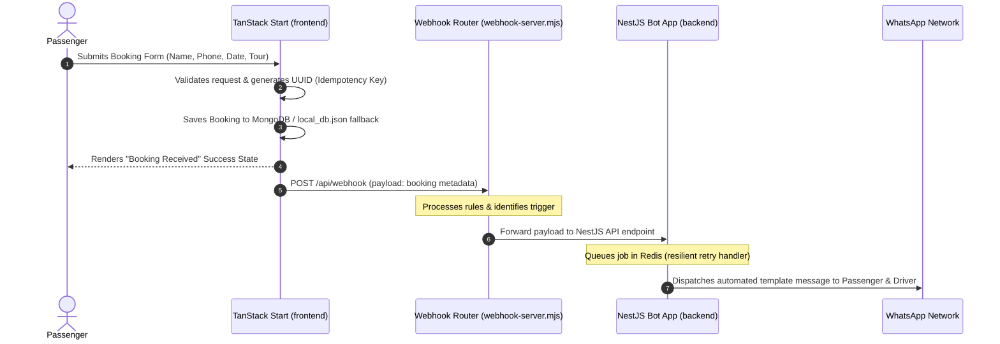
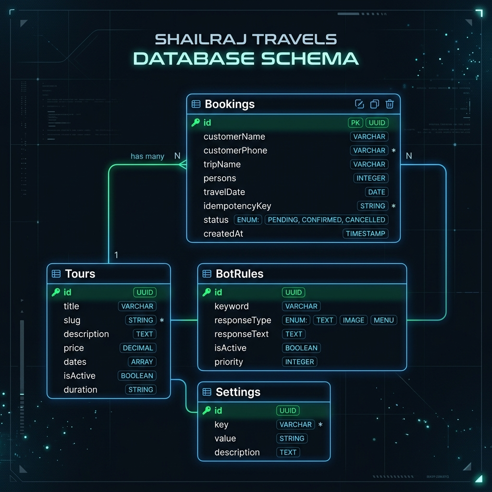

# Shailraj Travels: Enterprise System Architecture & Blueprint

This document serves as the master blueprint and reference guide for the **Shailraj Travels** platform. It outlines the complete system design, component interactions, database topologies, background engines, and guidelines for future updates.

---

## 1. System Topology Overview

Shailraj Travels is designed as a decoupled two-tier architecture consisting of an SSR-enabled web client (frontend) and an automated chat worker (backend).

### 📊 System Topology Diagram


<details>
<summary>View Text-Based Mermaid Source Code</summary>

```mermaid
graph TB
    subgraph Client Tier
        User([End User Web Browser])
        Admin([Admin Dashboard Web Browser])
    end

    subgraph Frontend Services (frontend/)
        Start[TanStack Start Server / SSR]
        Vite[Vite Client Bundle]
        WebhookRouter[Webhook Routing Server - webhook-server.mjs]
    end

    subgraph Backend Services (backend/)
        Nest[NestJS OpenWA Bot Controller]
        WaEngine[Baileys / WA-Web-JS Engine]
    end

    subgraph Database & Cache
        Mongo[(MongoDB Atlas / Local DB fallback)]
        Redis[(Redis Queue Store)]
    end

    subgraph External APIs
        Cloudinary[Cloudinary Media Store]
        WhatsAppNetwork[WhatsApp Network]
    end

    %% Client Interactions
    User -->|HTTP/HTTPS| Start
    Admin -->|HTTP/HTTPS| Start
    Start -->|Vite Client Hydration| Vite

    %% Frontend Database & External Links
    Start -->|Read/Write| Mongo
    Start -->|Upload Media| Cloudinary

    %% Frontend to Backend Connection
    Start -.->|Trigger Notification| WebhookRouter
    WebhookRouter -->|Forward Payload| Nest
    Nest -->|Enqueue Jobs| Redis

    %% Backend WA Engine Connection
    Nest -->|Manage Sessions| WaEngine
    WaEngine <-->|WebSocket/Signal| WhatsAppNetwork
```
</details>

---

## 2. Core Connection Idea & Communication Flow

The frontend and backend communicate asynchronously through a webhook-driven trigger system. This decouples the user-facing booking interface from the background automation bot.

### A. The Booking Notification Cycle

### 🔄 Booking Notification Flow


<details>
<summary>View Sequence Diagram Source Code</summary>


</details>

### B. WhatsApp Inbound Chat Routing (Bot Rules Engine)

1. An inbound chat message arrives from the **WhatsApp Network** to the active WhatsApp session inside the **Baileys Engine**.
2. The engine emits a message event which is intercepted by the NestJS **Message Module**.
3. The message content is evaluated against the rules configured inside `backend/src/modules/bot-rules/`:
   * If the message matches a keyphrase (e.g. "hi", "tours", "details"), the corresponding response is looked up in the database/rules cache.
   * An automated response payload is generated and pushed back through the engine to the user.

---

## 3. Directory Layout & Code Map

The project is divided into two separate, independent, deployable folders:

### A. Frontend (`frontend/`)
Responsible for Server-Side Rendering (SSR), public pages, Admin Dashboard, localization, and static asset delivery.

```
frontend/
├── scripts/
│   └── webhook-server.mjs       # Background webhook routing rules engine
├── src/
│   ├── backend/
│   │   ├── features/            # Server-side business logic (tours, bookings)
│   │   ├── infrastructure/      # Auth, Token management, Cloudinary client
│   │   └── shared/              # Database connections & fallback models
│   ├── frontend/
│   │   ├── core/                # Localization (i18n.ts), Icons, highlights
│   │   ├── features/            # UI components (Home, Tour details, Admin)
│   │   └── shared/              # UI widgets, layout templates, helpers
│   ├── routes/                  # TanStack Router folder-based routes
│   ├── styles.css               # Main styling (Tailwind CSS configuration)
│   └── start.ts                 # Dev server entry point
├── vite.config.ts               # Vite configuration (SSR and plugins)
└── tsconfig.json                # TypeScript configurations
```

### B. Backend (`backend/`)
Responsible for managing the WhatsApp connection sessions, dispatching messages, evaluating bot rules, and executing background queue workers.

```
backend/
├── src/
│   ├── modules/
│   │   ├── auth/                # JWT and API Key validation
│   │   ├── bot-rules/           # Dynamic keyword matching rules engine
│   │   ├── message/             # Bulk messaging dispatchers
│   │   ├── session/             # WhatsApp session state management
│   │   ├── mcp/                 # MCP Server integrations
│   │   └── wa-engine/           # Baileys / WhatsApp Web JS adapters
│   ├── database/                # Database entities, migrations, and CLI hooks
│   └── main.ts                  # NestJS server bootstrapper
├── Dockerfile                   # Docker image blueprint for Render deployments
└── tsconfig.json                # TypeScript compiler config
```

---

## 4. Key Logic & Code Snippets Reference

### A. Resilient Database Fallback
To prevent downtime, the frontend uses a fallback architecture that switches to a local file system storage database (`local_db.json`) if MongoDB Atlas becomes unreachable.
* Ref: [db.ts](file:///c:/Users/ASUS/OneDrive/Pictures/ドキュメント/Desktop/shailraj/frontend/src/backend/shared/db.ts)

```typescript
// Dynamically attempts to connect to MongoDB; switches to local fallback on failure
export async function getDbConnection() {
  try {
    const conn = await mongoose.connect(process.env.MONGODB_URI);
    return { type: 'mongodb', conn };
  } catch (error) {
    console.warn("MongoDB unavailable. Falling back to local file storage.");
    return { type: 'file', path: './local_db.json' };
  }
}
```

### B. Glassmorphism Design Token
The booking card uses glassmorphism components to integrate the overlay card into the scenic background:
* Ref: [Hero.tsx](file:///c:/Users/ASUS/OneDrive/Pictures/ドキュメント/Desktop/shailraj/frontend/src/frontend/features/home/Hero.tsx)

```tsx
<div 
  className="rounded-3xl bg-white/50 p-4 backdrop-blur-md" 
  style={{ boxShadow: "var(--shadow-luxury)" }}
>
  {/* Nested Fieldbox elements use match-blurs */}
  <div className="bg-white/60 rounded-2xl border border-slate-200">
    <input className="bg-transparent ..." />
  </div>
</div>
```

### C. Database Entity Model (ERD)
The database contains schemas for bookings, dynamic tour packages, bot rules, and system configurations.

### 🗄️ Database ERD Diagram


---

## 5. Deployment Setup

When deploying to hosting environments, use the following configurations:

| Component | Target Directory | Provider | Build Command | Start/Output Command |
| :--- | :--- | :--- | :--- | :--- |
| **Frontend** | `frontend/` | Cloudflare Pages | `npm run build` | Output: `.output/public` |
| **Backend** | `backend/` | Render (Web Service) | `npm install && npm run build` | `npm run start:prod` |
| **Webhook Router** | `frontend/scripts` | Render/PM2 | Run standalone script | `node webhook-server.mjs` |

---

## 6. Guidelines for Future Modifications

### How to Add a New Page/Route
1. Create a new file under `frontend/src/routes/` (e.g. `frontend/src/routes/my-new-page.tsx`).
2. Run `npm run dev` in the `frontend` folder. TanStack Router will automatically generate the corresponding route mappings inside `frontend/src/routeTree.gen.ts`.
3. Add translations for the page content inside `frontend/src/frontend/core/i18n.ts`.

### How to Add a New Bot Trigger Rule
1. Open `backend/src/modules/bot-rules/`.
2. Define the matching keyword condition in the rules evaluator database or within the local bot controller.
3. Hook the target response handler to dispatch your template message when the rule conditions are met.
